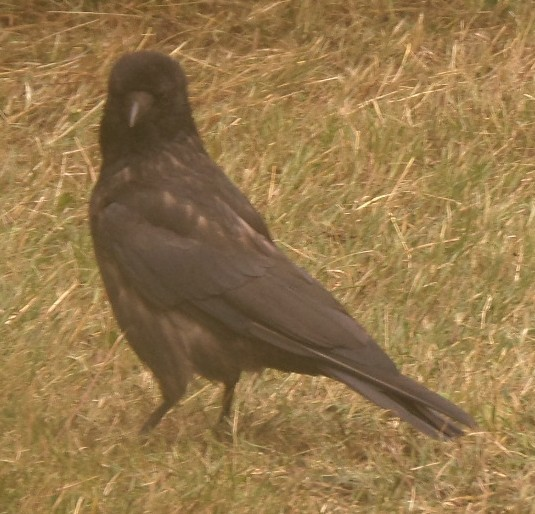

# Triangled-Images
An evolutionary Hill Climbing program that approximates an image through a combination of rectangles.

The inspiration for this program was the work by 

Base generation of triangles:

Disclamer: This is a work from 2011. Not my most complete 2011 version, but at least the one I could still 
find on my pc. Probably going to be updated soon.
